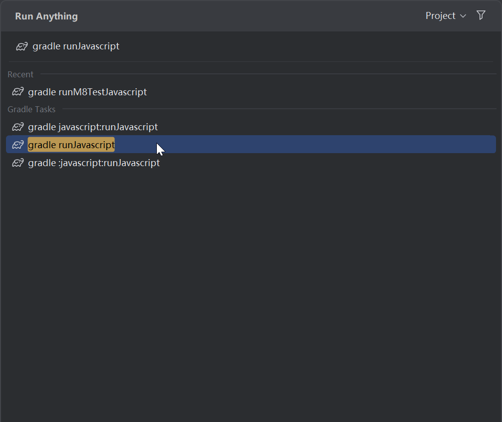
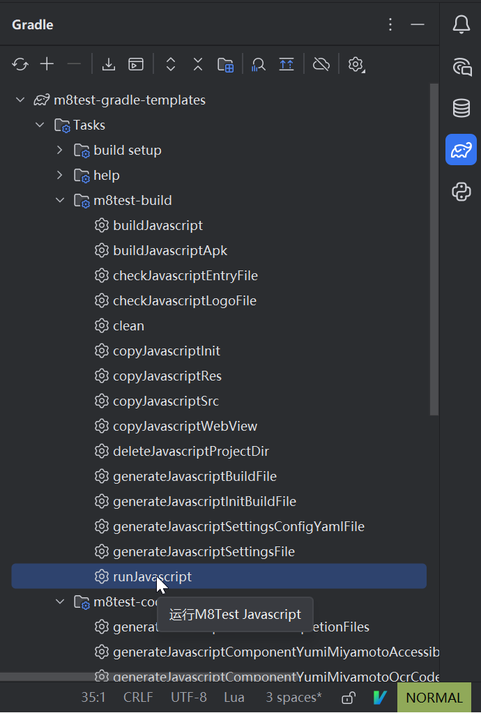
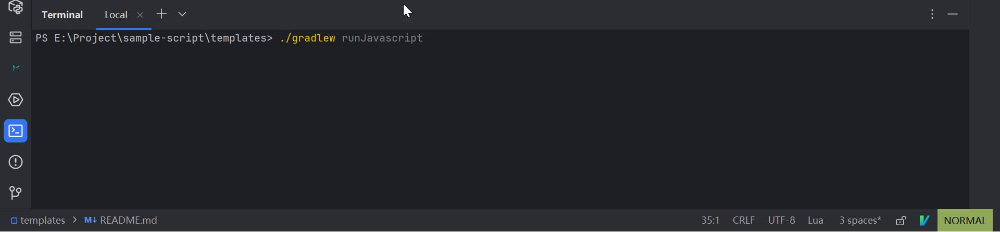
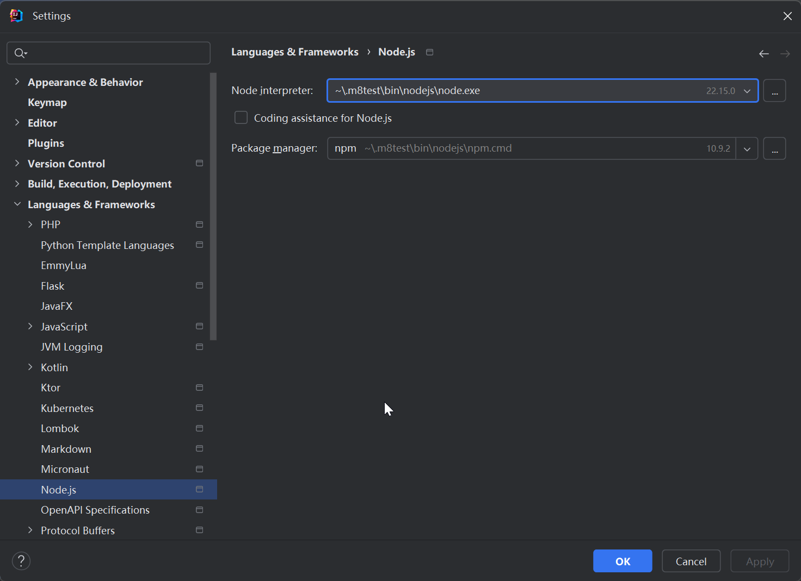
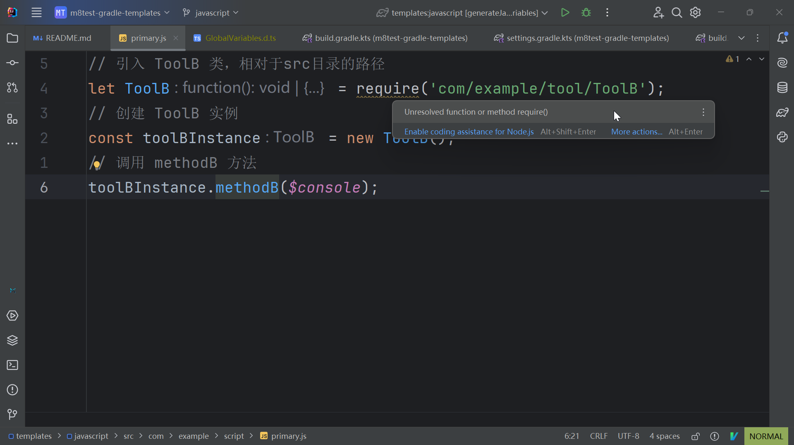
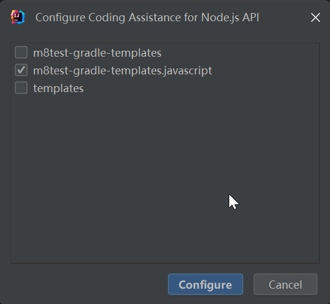
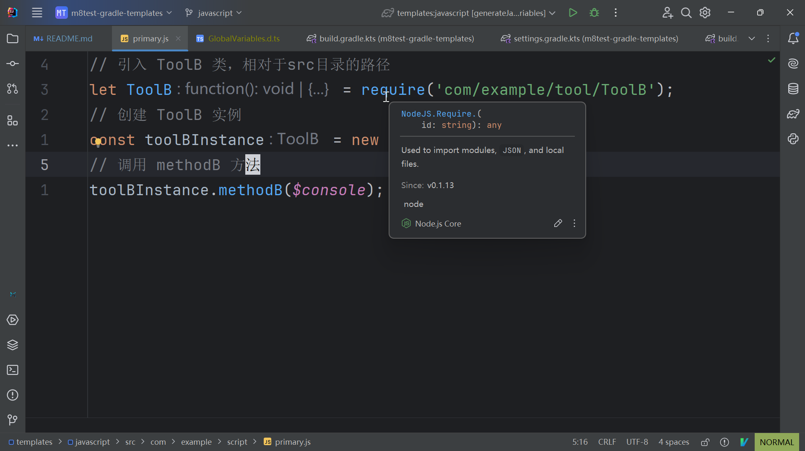

# [M8Test](https://dev-docs.m8test.com) Javascript Gradle 模板

> 如有疑问，请加入我们的官方 QQ 群：[749248182](https://qm.qq.com/q/jVVADJCAI8) 或 QQ
> 频道：[m8testofficial](https://pd.qq.com/s/8pidhywcy)

---

## 📦 Gradle 任务说明

### 任务分组

1. **`m8test-build`**  
   M8Test构建相关任务组，包含`buildJavascript`（构建Javascript项目）、`runJavascript`（运行项目）等任务。

2. **`m8test-code-completion`**  
   M8Test代码补全相关任务组，包含`generateJavascriptAllCodeCompletionFiles` （生成所有需要的代码补全文件）,
   `generateJavascriptGlobalVariables`（生成全局变量代码补全文件）等任务。

3. **`m8test-developmenet-environment`**  
   M8Test开发环境相关任务组，包含`installDevelopmentEnvironment`（安装开发环境）、`installJavascriptPlugin`（安装语言插件）等任务。

4. **`m8test-download`**  
   M8Test资源下载相关任务组，包含`downloadJavascriptCodeTemplate`（下载示例代码模板）、`downloadJavascriptDocs`（下载文档）等任务。

> 实际开发中主要关注构建任务和代码补全任务即可。

### 常用任务

| 任务名称                                                        | 任务分组                             | 功能描述                                                                                                   |
|-------------------------------------------------------------|----------------------------------|--------------------------------------------------------------------------------------------------------|
| `generateJavascriptAllCodeCompletionFiles`                  | `m8test-code-completion`         | 生成所有Javascript代码补全文件，会执行所有的 `generateJavascriptCodeXXXCodeCompletionFiles` 任务, 编写脚本之前执行一次此任务即可有代码提示功能。 |
| `generateJavascriptGlobalVariables`                         | `m8test-code-completion`         | 生成Javascript全局变量代码补全文件，提供IDE代码提示功能。需连接安卓设备，建议编写代码前执行一次，依赖更新后需重新执行。                                     |
| `generateJavascriptNormalAndroidCodeCompletionFiles`        | `m8test-code-completion`         | 生成 Android API 的 Javascript 代码提示文件。成功后，Javascript 代码中将有 Android API 的代码提示。                             |
| `generateJavascriptNormalDevelopmentKitCodeCompletionFiles` | `m8test-code-completion`         | 生成 M8Test API 的 Javascript 代码提示文件。成功后，Javascript 代码中将有 M8Test API 的代码提示。                               |
| `generateJavascriptComponentXXXCodeCompletionFiles`         | `m8test-code-completion`         | 生成 XXX 组件 API 的 Javascript 代码提示文件。成功后，Javascript 代码中将有 XXX 组件 API 的代码提示。                               |
| `buildJavascript`                                           | `m8test-build`                   | 构建M8Test Javascript脚本项目源码（不执行），构建结果位于`build/project`目录。                                                |
| `runJavascript`                                             | `m8test-build`                   | 构建并将项目推送到已连接的安卓设备上运行。                                                                                  |
| `buildJavascriptApk`                                        | `m8test-build`                   | 将M8Test Javascript脚本项目打包成APK文件。                                                                        |
| `installNodeJs`                                             | `m8test-development-environment` | 安装 Node.js。执行此任务会从网络下载 Node.js 并安装到 `~/.m8test/bin/nodejs` 目录。若已安装 Node.js，执行此任务不会重新安装。                |

---

## 🚀 执行任务的方法

### 方法一：使用快捷搜索

1. 双击 `Ctrl` 键，打开搜索框。
2. 输入 `gradle 任务名`，例如 `gradle runJavascript`，然后按回车执行。

   

### 方法二：通过 Gradle 面板

1. 点击 Gradle 图标。
2. 依次展开 `javascript` > `Tasks` > `m8test`。
3. 双击需要执行的任务。

   

### 方法三：使用终端命令

1. 按下快捷键 `Alt + F12` 打开终端。
2. 输入命令 `./gradlew 任务名`，例如 `./gradlew runJavascript`，然后按回车执行。

   

---

## ⚙️ 配置脚本项目

脚本项目的配置位于 `javascript/build.gradle.kts` 文件中。您可以根据需要修改设备的 IP、ADB 端口等参数。该文件中包含详细的代码注释，供参考。

---

## 🛠️ 项目开发流程

1. **生成代码提示文件**  
   执行 `generateJavascriptAllCodeCompletionFiles` 任务，生成 Javascript 代码补全文件，提供代码提示功能。

2. **安装 Node.js**  
   执行 `installNodeJs` 任务，安装 `Node.js`, 如果使用M8Test集成开发环境的话已经自带`Node.Js`, 此步骤可以跳过。

3. **配置 Node.js 环境**

    - 按下快捷键 `Ctrl + Alt + S` 打开设置。
    - 依次选择 `Language & Framework` > `Node.js` > `Node Interceptor`。
    - 点击 `Add` > `Add Local`，选择 Node.js 的安装路径，例如 `C:\Users\Your username\.m8test\bin\nodejs\node.exe`。
    - 点击 `OK`，然后点击 `Apply` 应用设置。

      

4. **启用 Node.js 代码助手**

   如果出现 `Unresolved function or method require()` 的提示，点击 `Enable coding assistance for Node.js`。

   

   在弹出的对话框中点击 `Configure` 按钮。

   

   等待启用成功，成功后界面如下所示：

   

5. **连接日志服务**

   按下快捷键 `Alt + T`，依次选择 `M8Test` > `连接日志服务`。

6. **编写并运行脚本**

   编写代码并保存后，执行 `runJavascript` 任务，即可在安卓设备上运行脚本项目。确保安卓设备已开启 ADB 调试。运行日志可在
   M8Test 日志面板中查看。

7. **打包Apk**  
   所有的脚本开发工作都完整后, 如果你需要打包成独立的apk可以执行 `buildJavascriptApk` 任务。